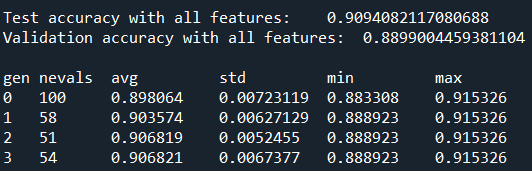

# GA-optimization-for-FS
Code for my academic research project titled "Optimizing Genetic Algorithm for Faster Convergence in Feature Selection"

## Abstract
Genetic algorithms (GA) are widely used for optimization problems due to their ability to explore the search space and find optimal solutions. 
However, the time required to evaluate the fitness function for everyone in the population can be a **bottleneck and lead to slow convergence**. 
To address this issue, we propose a novel approach to optimize the genetic algorithm for faster convergence. 
Our approach involves calculating the fitness function using batches of data, which significantly reduces the time required for each evaluation. 
We evaluate our approach on several benchmark problems and show that it leads to **improvement in the speed of convergence and the overall efficiency of the genetic
algorithm**. The fitness functions are typically based on **metric accuracy**. The algorithm then applies genetic operators such as **mutation and crossover** to evolve
the population of feature subsets. Our approach can be applied to a wide range of
**optimization problems** and can help **reduce the computational costs** associated with the genetic algorithm.

## Methodology
* Load and Prepare datasets
* Divide data into appropriate size batches  as per literature survey
* Calculate Fitness Score for Each Batch
* Calculate Fitness Score for Each Batch

### Baseline Accuracy

> This is baseline accuracy as a reference i.e. the accuracy of all should be around it

### Working of code in action

> Note: Time is not negative ! That's a dash (-) without space

## Conclusion
From all the results obtained from the conducted experiments, we have concluded the
following:
1. The most efficient batch size for the larger dataset (with data more than 40k) is
1024. This size may vary as the dataset size grows.
2. For the dataset of medium size (with data more than 10k and less than 30k) the
best batch size seems to be working is 256. Again, the size of the batch may also
vary as the size of dataset is at peak (around 30k or more). The size of 512 works
better on upper bound size whereas the 256 works on lower bound size.
3. The proposed model shows very high inconsistency on smaller dataset (with data
less than 2k – 3k). The dataset itself is so small that splitting it into smaller
batches doesn’t show any significant effects on results.

### References
1. Babatunde, Oluleye H., et al. "A genetic algorithm-based feature selection."
(2014).
2. Akbari, Reza, and Koorush Ziarati. "A multilevel evolutionary algorithm for
optimizing numerical functions." International Journal of Industrial Engineering Computations 2.2 (2011): 419-430.
3. Hassan, Rania, et al. "A comparison of particle swarm optimization and the
genetic algorithm." 46th AIAA/ASME/ASCE/AHS/ASC structures, structural
dynamics and materials conference. 2005.
4. Bajpai, Pratibha, and Manoj Kumar. "Genetic algorithm–an approach to solve
global optimization problems." Indian Journal of computer science and engineering 1.3 (2010): 199-206.
5. Kim, Dong Hwa, Ajith Abraham, and Jae Hoon Cho. "A hybrid genetic algorithm and bacterial foraging approach for global optimization." Information
Sciences 177.18 (2007): 3918-3937.
6. Leardi, Riccardo, Riccardo Boggia, and M. Terrile. "Genetic algorithms as a
strategy for feature selection." Journal of chemometrics 6.5 (1992): 267-281.
7. Tan, Feng, et al. "A genetic algorithm-based method for feature subset selection." Soft Computing 12 (2008): 111-120.
8. Oreski, Stjepan, and Goran Oreski. "Genetic algorithm-based heuristic for feature selection in credit risk assessment." Expert systems with applications 41.4
(2014): 2052-2064.
9. Pham, Hung Viet, et al. "Problems and opportunities in training deep learning
software systems: An analysis of variance." Proceedings of the 35th IEEE/ACM international conference on automated software engineering. 2020.
10. Keskar, Nitish Shirish, et al. "On large-batch training for deep learning: Generalization gap and sharp minima." arXiv preprint arXiv:1609.04836 (2016).
11. Kandel, Ibrahem, and Mauro Castelli. "The effect of batch size on the generalizability of the convolutional neural networks on a histopathology dataset."
ICT express 6.4 (2020): 312-315.

