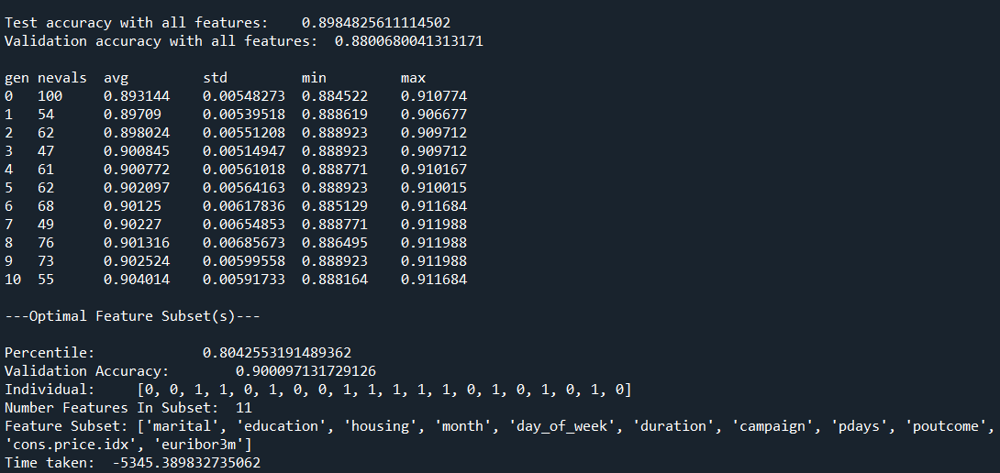

# GA-optimization-for-FS
Code for my academic research project titled "Optimizing Genetic Algorithm for Faster Convergence in Feature Selection"

## Abstract
Genetic algorithms (GA) are widely used for optimization problems due to their ability to explore the search space and find optimal solutions. 
However, the time required to evaluate the fitness function for everyone in the population can be a **bottleneck and lead to slow convergence**. 
To address this issue, we propose a novel approach to optimize the genetic algorithm for faster convergence. 
Our approach involves calculating the fitness function using batches of data, which significantly reduces the time required for each evaluation. 
We evaluate our approach on several benchmark problems and show that it leads to **improvement in the speed of convergence and the overall efficiency of the genetic
algorithm**. The fitness functions are typically based on **metric accuracy**. The algorithm then applies genetic operators such as **mutation and crossover** to evolve
the population of feature subsets. Our approach can be applied to a wide range of
**optimization problems** and can help **reduce the computational costs** associated with the genetic algorithm.

## Methodology
* Load and Prepare datasets
* Divide data into appropriate size batches  as per literature survey
* Calculate Fitness Score for Each Batch
* Calculate Fitness Score for Each Batch

### Baseline Accuracy

> This is baseline accuracy as a reference i.e. the accuracy of all should be around it

### Working of code in action

